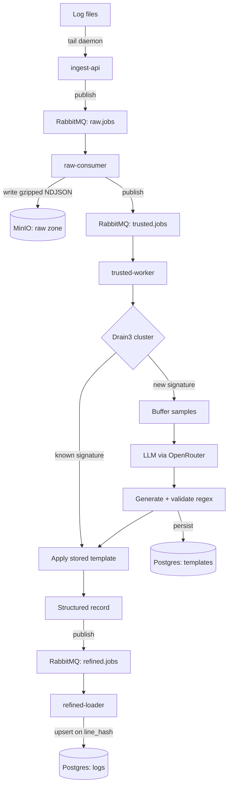
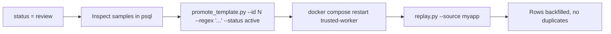

<div align="center">

# log_utils

**Self-hosted raw → trusted → refined log pipeline with LLM-inferred parsing templates.**

Point it at any log file. Drain3 clusters lines by shape, an LLM writes a named-group
regex for each new shape it sees, and structured rows land in Postgres.
No grok patterns. No per-format config. No parser maintenance.

<br>

[](plan.md)
[](#license)
[](#server-run-guide)

[](https://www.python.org/)
[](https://fastapi.tiangolo.com/)
[](https://www.rabbitmq.com/)
[](https://www.postgresql.org/)
[](https://min.io/)
[](https://docs.docker.com/compose/)
[](https://github.com/logpai/Drain3)
[](https://openrouter.ai/)

<sub>[Quick start](#quick-start) &nbsp;·&nbsp; [Architecture](#architecture) &nbsp;·&nbsp; [Server guide](#server-run-guide) &nbsp;·&nbsp; [Shipper guide](#shipper-run-guide) &nbsp;·&nbsp; [Querying](#querying-refined-data) &nbsp;·&nbsp; [Ops](#operations) &nbsp;·&nbsp; [Troubleshooting](#troubleshooting)</sub>

</div>

---

## What it does

A conventional log pipeline makes you write the parser. This one writes it for you,
once per log shape, and then never calls the model again for that shape.

```
   2026-07-05T10:00:01Z myapp INFO user=alice action=login status=success latency_ms=123
                                        │
                                        ▼
   {"app":"myapp", "level":"INFO", "user":"alice", "action":"login",
    "status":"success", "latency_ms":123, "timestamp":"2026-07-05T10:00:01Z"}
```

| | |
| --- | --- |
| **Zero-config parsing** | Drain3 groups lines by structural signature. First time a signature appears, the LLM produces a regex plus a typed field schema. Every later line with that signature reuses the stored template. |
| **Validated, not trusted** | Generated regexes are compiled and match-rate tested against buffered samples. Below threshold, the template lands in `status = 'review'` and is never auto-applied. |
| **Raw is immutable** | Every line is gzipped into MinIO before anything is parsed. Bad template today does not mean lost data — fix it and replay. |
| **Idempotent replay** | Dedup on `line_hash = sha256(object_key:line_no)`. Re-running a raw object never duplicates rows. |
| **Ack after write** | Manual ack at every stage. Messages only leave a queue once the corresponding write succeeded; failures dead-letter. |
| **Rotation-safe shipping** | The tail daemon tracks `(inode, offset)`, handles both rename+recreate and copytruncate, and never ships a partial trailing line. |

---

## Architecture



### The three zones

| Zone | Storage | Format | Mutable |
| --- | --- | --- | --- |
| **Raw** | MinIO, `raw-logs` bucket | Gzipped NDJSON, one object per ingest batch | No — source of truth |
| **Trusted** | Postgres, `templates` | Signature, regex, field schema, status, samples | Yes — templates get promoted/fixed |
| **Refined** | Postgres, `logs` | Structured rows, `fields` as JSONB | Append-only, deduped |

### Services

| Service | Port | Role |
| --- | --- | --- |
| `ingest-api` | `8000` | `POST /ingest` takes a batch of raw lines, publishes to `raw.jobs` |
| `raw-consumer` | — | Writes each batch to MinIO as `<source>/<date>/<hour>/<job_id>.ndjson.gz`, publishes `trusted.jobs` |
| `trusted-worker` | — | Multi-line join, Drain3 clustering, LLM template generation + validation, publishes `refined.jobs` |
| `refined-loader` | — | Upserts structured records into `logs`, deduped on `line_hash` |
| `postgres` | `5432` | `templates` + `logs` |
| `rabbitmq` | `5672`, `15672` | Three queues, each with a matching DLQ |
| `minio` | `9000`, `9001` | Raw zone object store |

<details>
<summary><b>Message flow, in detail</b></summary>

<br>

**`raw.jobs`**
```json
{ "job_id": "uuid", "source": "myapp", "lines": ["..."], "received_at": "2026-07-04T20:48:38.401583+00:00" }
```

**`trusted.jobs`**
```json
{ "job_id": "uuid", "source": "myapp", "object_key": "myapp/2026-07-04/20/uuid.ndjson.gz", "line_count": 400 }
```

**`refined.jobs`**
```json
{ "source": "myapp", "template_id": 2, "ts": "...", "raw_message": "...",
  "fields": { "user": "alice", "latency_ms": 123 }, "line_hash": "sha256..." }
```

Exchange `log.events` is direct and durable; routing key equals queue name.
Each queue dead-letters to `<name>.dlq` via `x-dead-letter-routing-key`.
Consumers use `prefetch=1` and manual ack — a handler that raises causes a
`basic_nack(requeue=False)`, sending the message straight to its DLQ rather
than into a redelivery loop.

</details>

<details>
<summary><b>How template inference actually works</b></summary>

<br>

1. `trusted-worker` pulls a raw object from MinIO and joins continuation lines
   (stack traces, wrapped messages) into single logical records.
2. Each record goes through Drain3 (`sim_th=0.4`, `depth=4`, `max_clusters=1000`).
3. State is keyed by `(source, cluster_id)` — not by the mined template text,
   which mutates as Drain3 generalizes the cluster further.
4. New cluster: buffer samples until `TEMPLATE_SAMPLE_THRESHOLD` (default 5).
5. At threshold, samples go to OpenRouter in JSON mode. The model returns
   `{"regex": "...", "fields": {"name": "type"}}` using named capture groups.
6. The regex is compiled and run against the buffered samples. Match rate at or
   above `TEMPLATE_VALIDATION_THRESHOLD` (default 0.8) means `status = 'active'`;
   below it, or on any LLM/network error, means `status = 'review'` with the
   placeholder regex `(?!)`, which compiles but matches nothing.
7. Active templates are applied to every subsequent line in the cluster. No
   further model calls for that signature.

Drain3 state and the resolved-template cache are per-process and in memory. They
reset on restart — which is exactly why promoting a template requires a
`docker compose restart trusted-worker` before replaying.

</details>

---

## Quick start

> **Prerequisites:** Docker Engine with Compose v2, Python 3.10+ on the host, and an
> [OpenRouter](https://openrouter.ai/) API key.

```bash
git clone git@github.com:Arc-001/log_utils.git
cd log_utils

cp .env.example .env
$EDITOR .env                      # fill in the four secrets, see below

docker compose up -d --build      # brings up the full stack
docker compose ps                 # all services should be up / healthy

python3 scripts/ship_logs.py --file /var/log/some.log --source myapp
```

Give it a moment (templates need `TEMPLATE_SAMPLE_THRESHOLD` samples per shape,
plus one LLM round trip each), then:

```bash
docker compose exec -T postgres psql -U log_utils -d log_utils \
  -c "SELECT source, fields FROM logs WHERE source = 'myapp' LIMIT 10;"
```

---

## Server run guide

### 1. Configure

```bash
cp .env.example .env
```

`.env` is gitignored. Generate real values for anything marked `<generate>`:

```bash
openssl rand -hex 24
```

| Variable | Default | Purpose |
| --- | --- | --- |
| `POSTGRES_DB` | `log_utils` | Database name |
| `POSTGRES_USER` | `log_utils` | Database user |
| `POSTGRES_PASSWORD` | — | **Required.** Database password |
| `RABBITMQ_DEFAULT_USER` | `log_utils` | Broker user |
| `RABBITMQ_DEFAULT_PASS` | — | **Required.** Broker password |
| `MINIO_ROOT_USER` | `log_utils` | Object store access key |
| `MINIO_ROOT_PASSWORD` | — | **Required.** Object store secret key (min 8 chars) |
| `MINIO_BUCKET` | `raw-logs` | Raw zone bucket |
| `OPENROUTER_API_KEY` | — | **Required.** Used only by `trusted-worker` |
| `OPENROUTER_MODEL` | `openrouter/auto` | Model for template generation |
| `TEMPLATE_SAMPLE_THRESHOLD` | `5` | Sample lines buffered per signature before calling the LLM |
| `TEMPLATE_VALIDATION_THRESHOLD` | `0.8` | Minimum sample match rate to mark a template `active` |

> **Note**
> `TEMPLATE_SAMPLE_THRESHOLD` and `TEMPLATE_VALIDATION_THRESHOLD` are read by
> `common/config.py` but are not wired into `docker-compose.yml` by default. To
> override them, add them to the `trusted-worker` `environment:` block.

### 2. Bring the stack up

```bash
docker compose up -d --build
```

Startup order is enforced by health checks and one-shot init containers:

```
postgres (healthcheck: pg_isready) ────────────┐
rabbitmq (healthcheck: diagnostics ping)       │
   └── rabbitmq-init  POSTs definitions.json ──┤──► ingest-api
minio    (healthcheck: mc ready)               │    raw-consumer
   └── minio-init     creates raw-logs bucket ─┘    trusted-worker
                                                    refined-loader
```

`rabbitmq-init` and `minio-init` are expected to exit `0` and stay exited. That is
success, not a crash.

### 3. Verify

```bash
docker compose ps                                    # health of every service
curl -s localhost:8000/health                        # {"status":"ok"}
docker compose logs -f trusted-worker                # watch templates get generated
```

| Console | URL | Credentials |
| --- | --- | --- |
| RabbitMQ management | http://localhost:15672 | `RABBITMQ_DEFAULT_USER` / `RABBITMQ_DEFAULT_PASS` |
| MinIO console | http://localhost:9001 | `MINIO_ROOT_USER` / `MINIO_ROOT_PASSWORD` |

### 4. Ingest API

<table>
<tr><td><code>POST /ingest</code></td><td>Accept a batch of raw lines</td></tr>
<tr><td><code>GET /health</code></td><td>Liveness</td></tr>
</table>

```bash
curl -sX POST localhost:8000/ingest \
  -H 'Content-Type: application/json' \
  -d '{"source":"demo","lines":["2026-07-05T10:00:01Z myapp INFO user=alice action=login status=success latency_ms=123"]}'
```

```json
{ "job_id": "3f2a...", "accepted": 1 }
```

An empty `lines` array returns `400`. The API holds one lazily reconnecting
RabbitMQ channel and retries a publish once on a dropped connection, so idle
periods do not cause spurious `500`s.

### 5. Lifecycle

```bash
docker compose logs -f <service>       # tail one service
docker compose restart trusted-worker  # required after promoting a template
docker compose down                    # stop, keep volumes
docker compose down -v                 # stop and DELETE all data
```

> **Warning**
> `docker compose down -v` removes the `pg_data`, `rabbitmq_data`, and `minio_data`
> volumes. That destroys the raw zone, every template, and every refined row.
> Back up before running it.

### 6. Exposure

Compose publishes `5432`, `5672`, `15672`, `9000`, `9001`, and `8000` on the host.
There is no auth, TLS, or rate limiting on `ingest-api` — this is by design and
listed as out of scope. On anything other than a trusted network, bind these to
localhost and front `ingest-api` with a reverse proxy that terminates TLS and
authenticates.

---

## Shipper run guide

Two ways to get lines into the pipeline. Both talk to the same `POST /ingest`
endpoint and default to `http://localhost:8000/ingest`.

### One-shot: `ship_logs.py`

Reads a whole file and POSTs it in batches. Good for backfills, testing, and cron.

```bash
python3 scripts/ship_logs.py --file /var/log/nginx/access.log --source nginx-access
```

| Flag | Default | Meaning |
| --- | --- | --- |
| `--file` | *required* | Log file to read |
| `--source` | *required* | Source name; becomes the MinIO prefix and the `logs.source` column |
| `--url` | `http://localhost:8000/ingest` | Ingest endpoint |
| `--batch-size` | `200` | Lines per HTTP request |

It re-reads the file from the start on every run. It has no memory of position —
use the daemon for anything continuous.

### Continuous: `shipper.py`

A tail daemon that watches files or globs and ships only what is new.

```bash
# follow every app log, one source name per file (derived from the basename)
python3 scripts/shipper.py --path '/var/log/myapp/*.log' --interval 2

# follow one file under an explicit source name
python3 scripts/shipper.py --path /var/log/syslog --source syslog

# watch several patterns at once
python3 scripts/shipper.py --path '/var/log/nginx/*.log' --path /var/log/syslog

# poll once and exit, for cron
python3 scripts/shipper.py --path '/var/log/myapp/*.log' --once
```

| Flag | Default | Meaning |
| --- | --- | --- |
| `--path` | *required* | File path or glob. Repeat the flag for multiple patterns. |
| `--source` | file basename | Source name applied to all matched files |
| `--url` | `http://localhost:8000/ingest` | Ingest endpoint |
| `--state-file` | `~/.log_utils/shipper_state.json` | Where `(inode, offset)` per file is persisted |
| `--interval` | `2.0` | Seconds between polls |
| `--batch-size` | `200` | Lines per HTTP request |
| `--once` | off | Poll once and exit instead of looping |

**Guarantees**

- **Resumes exactly.** State is `{path: {inode, offset}}`, written atomically via
  temp file plus `os.replace`, saved every poll and on `SIGINT`.
- **Survives rotation.** `rename + recreate` is detected by inode change;
  `copytruncate` by the file shrinking below the stored offset. Either way the
  offset resets to `0` and reading continues.
- **Never ships half a line.** A trailing chunk with no newline is left
  unconsumed, and the offset is not advanced, until the writer finishes it.
- **Globs are re-expanded every poll**, so files created after startup are picked up.

> **Note**
> The state file keys on the path string. Changing `--state-file` or the path
> spelling starts from offset `0` and re-ships the whole file. That is safe but
> wasteful — the refined layer dedupes on `line_hash`, but a re-shipped file gets
> new object keys, so those hashes differ and the rows will duplicate. Keep the
> state file stable.

### Running it as a systemd service

```ini
# /etc/systemd/system/log-utils-shipper.service
[Unit]
Description=log_utils tail shipper
After=network-online.target
Wants=network-online.target

[Service]
Type=simple
User=logship
WorkingDirectory=/opt/log_utils
ExecStart=/usr/bin/python3 scripts/shipper.py \
  --path /var/log/myapp/*.log \
  --path /var/log/nginx/access.log \
  --url http://127.0.0.1:8000/ingest \
  --interval 2
Restart=always
RestartSec=5

[Install]
WantedBy=multi-user.target
```

```bash
sudo systemctl daemon-reload
sudo systemctl enable --now log-utils-shipper
journalctl -u log-utils-shipper -f
```

The service user needs read access to every watched file and write access to the
state file directory. Both shipper scripts use only the standard library — no
`pip install` on the shipping host.

### Shipping from another machine

Point `--url` at the pipeline host and make sure `ingest-api` is reachable there:

```bash
python3 scripts/shipper.py --path '/var/log/app/*.log' \
  --url http://logs.internal:8000/ingest
```

Since `/ingest` is unauthenticated, restrict it at the network or proxy layer.

---

## Querying refined data

`fields` is JSONB with a GIN index; `(source, ts)` is indexed too.

```bash
psql() { docker compose exec -T postgres psql -U log_utils -d log_utils "$@"; }
```

```sql
-- recent structured lines for one source
SELECT ts, fields
FROM logs
WHERE source = 'myapp'
ORDER BY ts DESC
LIMIT 20;

-- filter on an extracted field
SELECT ts, fields->>'user' AS "user", fields->>'action' AS action
FROM logs
WHERE source = 'myapp' AND fields->>'status' = 'failure';

-- containment query, uses the GIN index
SELECT count(*) FROM logs WHERE fields @> '{"level":"ERROR"}';

-- slowest requests
SELECT ts, fields->>'action', (fields->>'latency_ms')::int AS ms
FROM logs
WHERE fields ? 'latency_ms'
ORDER BY ms DESC
LIMIT 10;

-- how many lines each template is responsible for
SELECT t.id, t.status, count(l.id) AS rows, left(t.regex, 60) AS regex
FROM templates t LEFT JOIN logs l ON l.template_id = t.id
GROUP BY t.id ORDER BY rows DESC;

-- templates awaiting human review
SELECT id, status, regex, sample_lines[1]
FROM templates WHERE status = 'review';
```

<details>
<summary><b>Schema</b></summary>

<br>

```sql
CREATE TABLE templates (
    id            BIGSERIAL PRIMARY KEY,
    signature     TEXT NOT NULL UNIQUE,     -- sha256(source::mined_template)
    regex         TEXT NOT NULL,
    fields_schema JSONB NOT NULL DEFAULT '{}',
    sample_lines  TEXT[] NOT NULL DEFAULT '{}',
    model_used    TEXT,
    status        TEXT NOT NULL DEFAULT 'review',   -- 'active' | 'review'
    created_at    TIMESTAMPTZ NOT NULL DEFAULT now()
);

CREATE TABLE logs (
    id           BIGSERIAL PRIMARY KEY,
    source       TEXT NOT NULL,
    template_id  BIGINT REFERENCES templates(id),
    ts           TIMESTAMPTZ,
    raw_message  TEXT NOT NULL,
    fields       JSONB NOT NULL DEFAULT '{}',
    line_hash    TEXT UNIQUE,               -- sha256(object_key:anchor_line_no)
    created_at   TIMESTAMPTZ NOT NULL DEFAULT now()
);

CREATE INDEX ON logs (source, ts);
CREATE INDEX ON logs USING GIN (fields);
```

`line_hash` identifies the physical raw line regardless of which template matched
it, which is what makes replay idempotent under `ON CONFLICT DO NOTHING`.

</details>

See [`docs/pipeline-stage-samples.md`](docs/pipeline-stage-samples.md) for the same
log line rendered at all three stages, using real data from a live run.

---

## Operations

### Template review workflow

A template that fails generation, or whose regex does not clear the validation
match rate, is stored with `status = 'review'` and is never applied. Raw data is
unaffected — it lives in MinIO independent of template status.



```bash
# 1. look at what failed
docker compose exec -T postgres psql -U log_utils -d log_utils \
  -c "SELECT id, regex, sample_lines[1] FROM templates WHERE status='review';"

# 2. fix and promote
python3 scripts/promote_template.py --id 17 --regex '(?P<ts>\S+) (?P<host>\S+) ...' --status active

# 3. REQUIRED: the worker caches resolved template state per cluster in memory
docker compose restart trusted-worker

# 4. re-run the affected raw objects
python3 scripts/replay.py --source myapp
```

> **Warning**
> Skipping step 3 makes step 4 a no-op for the promoted template. `trusted-worker`
> resolves each cluster's template once per process lifetime and will not observe
> the database change until it restarts.

### Replay

```bash
python3 scripts/replay.py --source kernel
python3 scripts/replay.py --object-key kernel/2026-07-04/20/abc123.ndjson.gz
```

Republishes raw object keys onto `trusted.jobs` through the RabbitMQ management
API. Idempotent: `refined-loader` dedupes on `line_hash`, so re-running an object
never duplicates rows already in `logs`.

> **Note**
> `promote_template.py` and `replay.py` read `.env` relative to the current
> directory and shell out to `docker compose`. Run them from the repository root,
> on the host running the stack.

### Dead-letter queues

Every queue has a `.dlq` sibling. A handler that raises nacks without requeue, so
the message lands there instead of looping.

```bash
docker compose exec rabbitmq rabbitmqctl list_queues name messages
```

Non-zero counts on `raw.jobs.dlq`, `trusted.jobs.dlq`, or `refined.jobs.dlq` mean
something failed — check that service's logs. Inspect or drain messages from the
management UI at http://localhost:15672.

### Backups

```bash
docker compose exec -T postgres pg_dump -U log_utils log_utils | gzip > db.sql.gz
docker compose exec -T minio mc mirror local/raw-logs ./raw-backup/
```

The raw zone is the one that matters. Templates and refined rows can be
regenerated from it by replay; the raw objects cannot be regenerated from anything.

---

## Troubleshooting

<details>
<summary><b>Templates are all stuck in <code>status = 'review'</code> with regex <code>(?!)</code></b></summary>

<br>

`(?!)` is the placeholder written when template generation fails outright. Almost
always an LLM call problem:

```bash
docker compose logs trusted-worker | grep -i -E 'error|openrouter|timeout'
```

Check that `OPENROUTER_API_KEY` is set in `.env` and that the account has credit.
The request has a 30 second timeout and expects JSON-mode output — a model that
ignores `response_format` will fail to parse. Try pinning a known-good model in
`OPENROUTER_MODEL` instead of `openrouter/auto`.
</details>

<details>
<summary><b>Lines are shipping but nothing appears in <code>logs</code></b></summary>

<br>

Walk the stages in order:

```bash
docker compose exec minio mc ls --recursive local/raw-logs/    # raw zone populated?
docker compose exec rabbitmq rabbitmqctl list_queues name messages
docker compose logs trusted-worker | tail -50
docker compose exec -T postgres psql -U log_utils -d log_utils -c "SELECT count(*) FROM templates;"
```

If the raw zone has objects but `templates` is empty, the signature has not yet
reached `TEMPLATE_SAMPLE_THRESHOLD` samples. Ship more lines of the same shape.
If templates exist but are all `review`, see the previous entry.
</details>

<details>
<summary><b><code>rabbitmq-init</code> or <code>minio-init</code> shows as exited</b></summary>

<br>

Expected. They are one-shot containers that load the queue definitions and create
the bucket, then exit `0`. Confirm the exit code:

```bash
docker compose ps -a
docker compose logs rabbitmq-init minio-init
```

A non-zero exit means the definitions POST or bucket creation failed — usually
credentials in `.env` not matching what the broker or object store came up with.
</details>

<details>
<summary><b>Shipper re-ships everything after a restart</b></summary>

<br>

The state file was lost or the path key changed. Check:

```bash
cat ~/.log_utils/shipper_state.json
```

Under systemd, a `User=` without a writable home, or a `--state-file` under a
tmpfs, drops state on every restart. Point `--state-file` at a persistent,
writable location owned by the service user.
</details>

<details>
<summary><b>Ingest returns 500 after the stack has been idle</b></summary>

<br>

Should not happen — `ingest-api` reconnects once on `AMQPConnectionError` or
`StreamLostError` before giving up, and connections use a 600 second heartbeat.
If it persists, RabbitMQ is genuinely down:

```bash
docker compose ps rabbitmq
docker compose logs rabbitmq | tail -30
```
</details>

<details>
<summary><b>Duplicate rows in <code>logs</code> after re-shipping a file</b></summary>

<br>

Expected, and distinct from replay. Dedup is on `sha256(object_key:line_no)`.
Replaying an existing raw object reuses its key, so it dedupes. Re-*shipping* the
same file creates a new object with a new `job_id` in the key, so the hashes
differ and the lines land again. Use `replay.py` to reprocess, never a re-ship.
</details>

---

## Project layout

```
log_utils/
├── common/                  Shared config, RabbitMQ, and Postgres helpers
│   ├── config.py            All env-driven settings, queue and exchange names
│   ├── mq.py                Connection retry, publish, consume_forever w/ manual ack
│   └── db.py                Postgres connection helper
├── services/                One directory per service, each with its own Dockerfile
│   ├── ingest_api/          FastAPI, POST /ingest
│   ├── raw_consumer/        MinIO writer
│   ├── trusted_worker/      Drain3 + LLM + validation
│   │   ├── main.py          Clustering, template resolution, record emission
│   │   ├── llm.py           OpenRouter client and system prompt
│   │   ├── templates_store.py
│   │   └── multiline.py     Continuation-line join heuristic
│   └── refined_loader/      Postgres upsert
├── infra/
│   ├── init-db.sql          templates + logs schema and indexes
│   └── rabbitmq/definitions.json   Exchange, queues, DLQs, bindings
├── scripts/                 Host-side operational scripts, stdlib only
│   ├── shipper.py           Continuous tail daemon
│   ├── ship_logs.py         One-shot file shipper
│   ├── promote_template.py  Edit regex / flip status
│   └── replay.py            Re-run raw objects through the trusted stage
├── docs/
│   └── pipeline-stage-samples.md   Real data at each of the three stages
├── docker-compose.yml
└── plan.md                  Phased implementation plan
```

---

## Development

```bash
docker compose up -d postgres rabbitmq minio rabbitmq-init minio-init  # infra only
docker compose up -d --build trusted-worker                            # rebuild one service
docker compose logs -f trusted-worker
```

Services import from `common/`, so every Dockerfile builds with the repository root
as its context. Commits follow [Conventional Commits](https://www.conventionalcommits.org/).

---

## License

No license file is present in this repository yet, so default copyright applies
and no usage rights are granted. Add a `LICENSE` file to change that.
