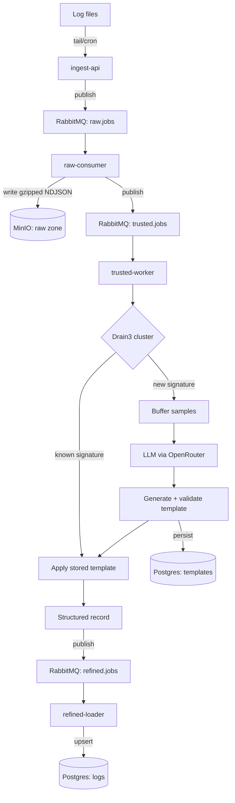

# log_utils

Self-hosted raw -> trusted -> refined log pipeline with LLM-assisted
template inference. Log formats are learned automatically: Drain3
clusters incoming lines by shape, and an LLM generates a parsing
template (regex + field schema) for each new shape the first time it
appears. Structurification after that point requires no manual config.

## Architecture



| Stage    | Storage                     | Format                                    |
| -------- | ---------------------------- | ------------------------------------------ |
| Raw      | MinIO (`raw-logs` bucket)    | Gzipped NDJSON, one object per ingest batch |
| Trusted  | Postgres (`templates` table) | Signature, regex, field schema, status      |
| Refined  | Postgres (`logs` table)      | Structured rows, `fields` as JSONB          |

## Services

| Service          | Role                                                                 |
| ---------------- | --------------------------------------------------------------------- |
| `ingest-api`      | `POST /ingest` accepts a batch of raw lines, publishes to `raw.jobs`  |
| `raw-consumer`    | Writes each batch to MinIO, publishes `trusted.jobs`                 |
| `trusted-worker`  | Drain3 clustering, LLM template generation and validation, publishes `refined.jobs` |
| `refined-loader`  | Upserts structured records into Postgres, deduped on `line_hash`     |

RabbitMQ decouples every stage. Each queue (`raw.jobs`, `trusted.jobs`,
`refined.jobs`) has a matching DLQ; messages are only acked once the
corresponding write succeeds.

## Requirements

- Docker and Docker Compose
- An OpenRouter API key

## Setup

```bash
cp .env.example .env
# fill in POSTGRES_PASSWORD, RABBITMQ_DEFAULT_PASS, MINIO_ROOT_PASSWORD,
# OPENROUTER_API_KEY, OPENROUTER_MODEL

docker compose up -d --build
```

## Usage

Ship a log file through the pipeline:

```bash
python3 scripts/ship_logs.py --file /var/log/some.log --source myapp
```

Query refined data directly:

```bash
docker exec -it log_utils-postgres-1 psql -U log_utils -d log_utils \
  -c "SELECT source, fields FROM logs WHERE source = 'myapp' LIMIT 10;"
```

## Template review workflow

Templates that fail LLM generation or don't clear the validation match
rate are stored with `status = 'review'` instead of `active`, so they
are not applied automatically. Raw data is preserved regardless, since
it lives in MinIO independent of template status.

Fix and promote a template:

```bash
python3 scripts/promote_template.py --id 17 --regex '<new pattern>' --status active
docker compose restart trusted-worker   # required: cached template state resets on restart
python3 scripts/replay.py --source myapp
```

Replay is idempotent. `refined-loader` dedupes on `line_hash`, a hash
of the raw object key and line offset, so re-running an object never
duplicates rows already in `logs`.

## Configuration

Key environment variables (see `.env.example` for the full list):

| Variable                         | Default          | Purpose                                     |
| --------------------------------- | ----------------- | -------------------------------------------- |
| `OPENROUTER_MODEL`                 | `openrouter/auto`  | Model used for template generation           |
| `TEMPLATE_SAMPLE_THRESHOLD`         | `5`                | Sample lines buffered before calling the LLM |
| `TEMPLATE_VALIDATION_THRESHOLD`     | `0.8`              | Minimum match rate to mark a template active |

## Project layout

```
common/            Shared config, RabbitMQ, and Postgres helpers
services/          One directory per service, each with its own Dockerfile
infra/             Postgres schema, RabbitMQ exchange/queue definitions
scripts/           Host-side operational scripts (ship, promote, replay)
docs/              Reference material, e.g. real pipeline stage samples
plan.md            Phased implementation plan
```

## Status

Phases 1-6 of `plan.md` are implemented and verified against real log
data (journald, kernel, systemd boot sequence, and a synthetic app
log). Phase 7 (a continuous tail-based shipper agent, replacing the
manual/cron script) is not yet implemented.

Out of scope: search API/UI (query via `psql` directly), multi-user
support, auth, TLS, automatic reprocessing when templates improve
(replay is manual-trigger only).
