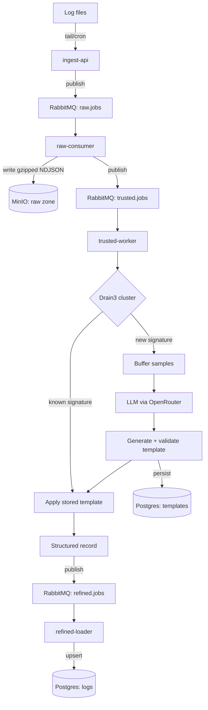

# log_utils — Implementation Plan

Raw → Trusted → Refined log pipeline, self-hosted, LLM-assisted template
inference (Drain3 + OpenRouter). See design discussion for full rationale.

## Architecture recap

Stack: FastAPI (ingest-api), RabbitMQ, MinIO, Drain3, OpenRouter, Postgres
(JSONB fields), Docker Compose, single host.

---

## Phase 1 — Infra skeleton

- `docker-compose.yml`: rabbitmq, minio, postgres services only.
- `init-db.sql`: `templates` table (id, signature, regex, fields_schema
  JSONB, sample_lines, model_used, created_at, status) and `logs` table
  (id, source, template_id FK, ts, raw_message, fields JSONB).
- Declare RabbitMQ exchange/queues on startup: `raw.jobs`, `trusted.jobs`,
  `refined.jobs`, each with a `*.dlq`, durable, manual ack.
- MinIO: create `raw-logs` bucket (init/startup script).
- Verify: all containers healthy, can manually publish/consume a test
  message on each queue, can insert/query a row in each Postgres table.

## Phase 2 — Raw ingestion path (end-to-end skeleton, no parsing yet)

- `ingest-api` (FastAPI): `POST /ingest` — accepts `{source, lines: [...]}`,
  publishes one message per batch to `raw.jobs`.
- `raw-consumer`: consumes `raw.jobs`, batches by source+hour, writes
  gzipped NDJSON to MinIO (`raw-logs/<source>/<date>/<hour>.ndjson.gz`),
  publishes `trusted.jobs` with the object key.
- Manual test script: tail a real log file (nginx or the user's web
  server) for N lines, POST to ingest-api, confirm object lands in MinIO.
- Verify: end-to-end — real log lines in, gzipped object in MinIO,
  `trusted.jobs` message published, manual ack only after MinIO write
  succeeds.

## Phase 3 — Drain3 clustering (no LLM yet)

- `trusted-worker`: consumes `trusted.jobs`, reads object from MinIO.
- Multi-line join heuristic (e.g. join continuation lines for stack
  traces) before tokenizing.
- Run lines through Drain3, log cluster id + template string for each
  line (no persistence yet) — this is a tuning pass.
- Tune depth / similarity threshold against real nginx + syslog + web
  server logs until clustering looks sane (eyeball cluster counts vs
  expected distinct formats).
- Verify: run against a sample of real logs, manually confirm cluster
  count and grouping make sense (e.g. nginx access lines cluster
  together, distinct from error lines).

## Phase 4 — LLM template generation + validation

- On new/updated Drain3 cluster: buffer N sample lines for that
  signature.
- Call OpenRouter (structured/JSON-mode output) with buffered samples,
  request: named-group regex + field name/type list.
- Validate: compile regex, test against buffered samples; only persist
  to `templates` table with `status=active` if match rate clears
  threshold, else `status=review`.
- Apply active templates to matching lines → structured record
  (dict of extracted fields + raw_message + source + ts).
- Publish structured records to `refined.jobs`.
- Verify: feed a genuinely new log format through the pipeline, confirm
  a template gets generated, validated, stored, and applied — check the
  `templates` row and resulting structured record by hand.

## Phase 5 — Refined loader

- `refined-loader`: consumes `refined.jobs`, upserts into `logs` table
  (`fields` as JSONB).
- Verify: query `logs` via `psql` with `fields->>'...'` filters against
  real ingested data; confirm querying works as expected for at least
  two different template types.

## Phase 6 — Replay + review workflow

- Script to re-run raw MinIO objects through trusted-worker (replay),
  for when a `review`-status template is fixed/promoted manually.
- Manual promotion path: edit/approve a `review` template → re-trigger
  trusted stage for affected raw objects.
- Verify: force a bad template into `review`, fix it, replay, confirm
  `logs` table gets backfilled correctly without duplicate rows (upsert
  semantics on replay).

## Phase 7 — Shipper agent (stretch)

- Continuous tail daemon (watches log dir/files, ships new lines to
  ingest-api) replacing the manual/cron script from Phase 2.
- Verify: daemon survives log rotation, resumes from correct offset on
  restart.

---

## Out of scope (explicit)

- Search API / UI — query via `psql` directly.
- Multi-user, auth, TLS.
- Snowflake or other hosted/managed DB.
- Fully automatic reprocessing when templates improve (Phase 6 replay is
  manual-trigger only).
